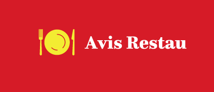

# Avis Restau

Avis Restau souhaite améliorer sa plateforme avec une **nouvelle fonctionnalité de collaboration** pour ses utilisateurs où ils pourront par exemple poster des avis et des photos sur leur restaurant préféré.

C’est aussi un moyen de mieux comprendre les avis postés par les utilisateurs.

Ider, le CTO de l’entreprise, à des souhaits que nous pouvons diviser en deux parties, textuel et visuel :
- Ses besoins textuels sont la détection des sujets d’insatisfaction présents dans les commentaires postés sur la plateforme.
- Ses besoins visuels sont la labellisation automatique des photos postées sur la plateforme. Par exemple, identifier les photos relatives à la nourriture, au décor dans le restaurant ou à l’extérieur du restaurant.

Cependant, Avis Restau manque de données. Nous allons donc utiliser la base de données de Yelp pour réaliser une preuve de concept.

Donc pour répondre à sa demande le projet sera divisé ainsi :
1. Récolte des données sur Yelp
2. Analyse textuelle
3. Analyse visuelle